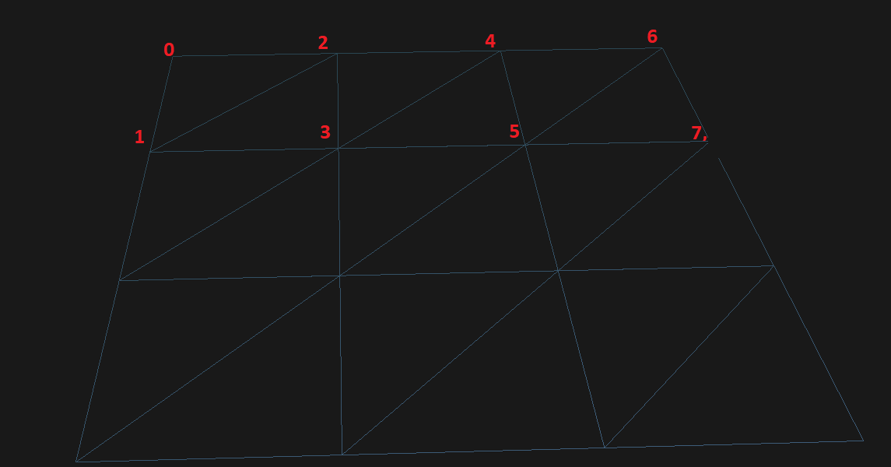
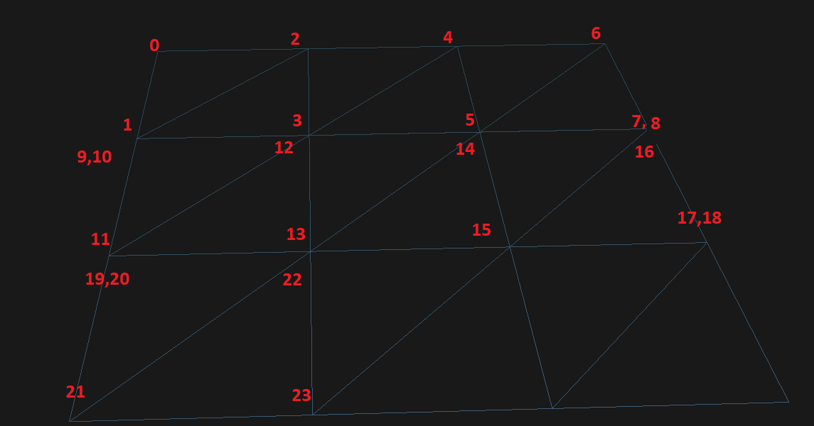
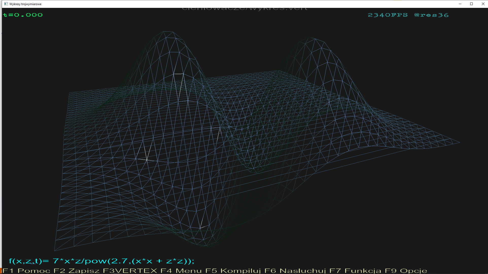
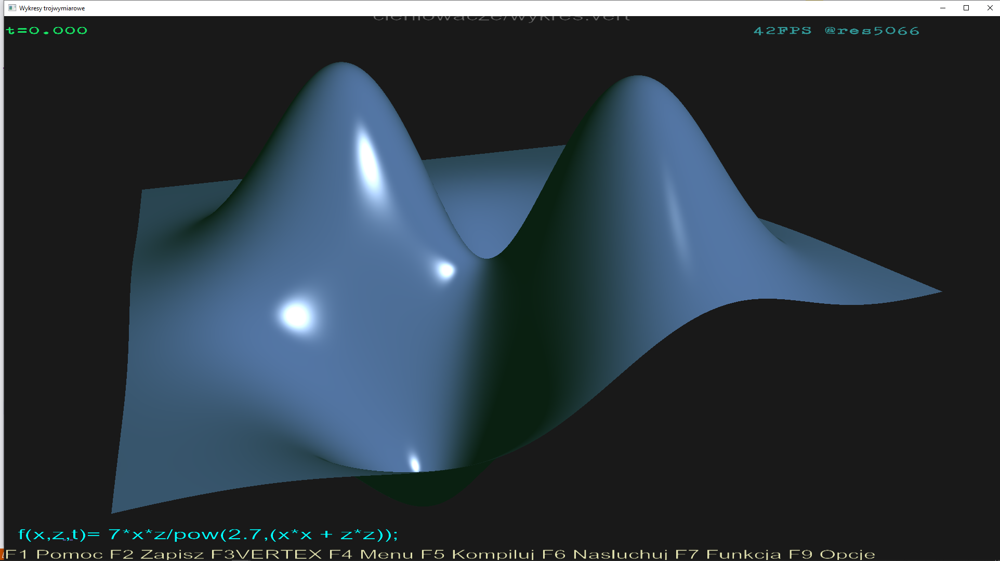

# O pewnej funkcji mapującej w GLSL
Jeśli spotkałeś się kiedyś z niskopoziomową grafiką 3D, na przykład OpenGL, to pewnie zetknąłeś się z problemem rysowania płaszczyzny za pomocą trójkątów. Jeśli robi się to w najprostszy sposób, to jak łatwo policzyć, punkty nie będące na krawędzi takiej siatki są powtarzane 6 razy, a przecież nie chcemy zapychac magistrali zbędnymi danymi. Przy okazji dobrze by było użyć jak najmniejszej liczby wywołań rysowania (drawing calls), żeby jescze przyspieszyć proces, na przykład całą płasczyznę renderować jakoś tak:
```markdown
glBindVertexArray(VAO);
glDrawArrays(GL_TRIANGLE_STRIP, 0, liczba_wierzchołków);
```
gdzie `GL_TRAINGLE_STRIP` działa interpretuje bufory tak:
```markdown
Indices:     0 1 2 3 4 5 ...
Triangles:  {0 1 2}
              {1 2 3}  drawing order is (2 1 3) to maintain proper winding
                {2 3 4}
                  {3 4 5}  drawing order is (4 3 5) to maintain proper winding
```

(zob. [tu](https://www.khronos.org/opengl/wiki/Primitive))

Oczywiście da sie tak narysować pojedynczy prostokątny pas złożony z trójkątów, ale całą płasczyznę? Ciężka sprawa, ale spróbjmy podejść do problemu w sposób łopatologiczny. Narysujmy sobie taką siatkę...


...ponumerujmy wierzchołki w jednym pasie...

...i co dalej? Zwyczajnie zawińmy się na początek i radośnie powtórzmy powtórzmy procedurę. Cóż, jednak wtedy uzyskamy wielki brzydki trójkąt w poprzek całego pasa rozpoięty na wierzchołkach 7,8,9. Żaden problem. To zostawmy je sobie na końcu tak:

Zaraz, zaraz, ale nie pozbyliśmy się przeciez tego wielkiego trójkąta, tylko dodaliśmy właściwie dwa, o zerowej szerokości:
Owszem, jak spróbujemy narysować jakąś niepłaską płasczyznę.

Rzeczywiście widac linie w poprzek. Ale mi była potrzebna pełna płaszczyzna :stuck_out_tongue:

A jak sie okazuje `glPolygonMode( GL_FRONT_AND_BACK, GL_FILL );` sprawia, że prymitywy o zerowej powierzchni w ogóle nie są rysowane.

### Właściwa funkcja
mając to wszystko można napisać funkcję, na przykład taką:

```markdown
vec2 poz2d(int n, int s)//nr wierzcholka, szerokosc siatki
{
    int lp = n%(2*s+2);
    if(lp==0){n++;lp++;}
    if(lp==2*s+1){n--;lp--;}
    int x = (lp-1)/2;
    int y = n/(2*s+2);
    if(lp%2==0){y++;}
    return vec2(x,y);
}
```
